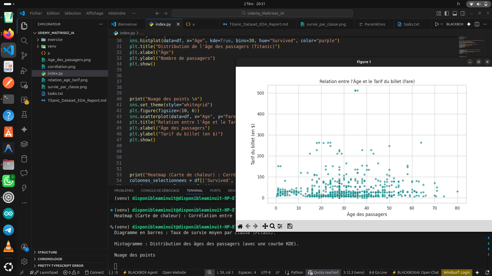

# 🚢 Titanic Survival Analysis

Analyse de données visant à comprendre **quels facteurs ont influencé la survie des passagers du Titanic** à partir du jeu de données classique de Kaggle.

---

## 📌 Objectif du projet

L’objectif de ce projet est de :
- Explorer le jeu de données du Titanic
- Nettoyer les données manquantes
- Identifier les facteurs clés de survie
- Visualiser les résultats de manière claire
- Tirer des conclusions basées sur les données

Ce projet s’inscrit dans une démarche d’**initiation à la data analysis** et à la **prise de décision basée sur les données**.

---

## 📊 Jeu de données

- **Source** : Titanic Dataset (Kaggle)
- **Nombre d’observations** : 891 passagers
- **Variables principales** :
  - `Survived` : survie (0 = non, 1 = oui)
  - `Pclass` : classe sociale
  - `Sex` : sexe
  - `Age` : âge
  - `Fare` : prix du billet
  - `Embarked` : port d’embarquement
  - `Cabin` : cabine

---

## 🧹 Nettoyage des données

Les actions suivantes ont été réalisées :

- **Âge (`Age`)** : valeurs manquantes remplacées par la médiane
- **Port d’embarquement (`Embarked`)** : valeurs manquantes remplacées par la mode
- **Cabine (`Cabin`)** : trop de valeurs manquantes → remplacées par `"Inconnu"`

Ces choix permettent de conserver un maximum de données exploitables.

---

## 🔍 Résultats clés (Key Insights)

### 🏷️ Classe sociale
- Classe 1 : **62 %** de survie
- Classe 3 : **24 %** de survie

👉 La classe sociale est l’un des facteurs les plus déterminants de la survie.

---

### 👶 Âge
- La majorité des passagers avaient entre **20 et 40 ans**
- Les enfants présentent un taux de survie plus élevé, suggérant une priorité lors de l’évacuation

---

### 💰 Prix du billet
- Une **corrélation positive** existe entre le prix du billet et la survie
- Les billets plus chers correspondent majoritairement à la 1ère classe

---

## 📈 Visualisations

Les résultats sont appuyés par plusieurs graphiques :
- **Scatter Plot** : relation entre le prix du billet et la survie
- **Heatmap** : corrélation entre les variables numériques

Ces visualisations permettent de mieux comprendre les tendances observées.

---

## 🧠 Conclusion

L’analyse montre que la **classe sociale** a joué un rôle central dans la survie des passagers, en complément de règles de priorité comme *« les femmes et les enfants d’abord »*.

> **En résumé :** les passagers les plus favorisés avaient significativement plus de chances de survivre.

---

## 🛠️ Technologies utilisées

- Python
- Pandas
- NumPy
- Matplotlib / Seaborn
- Jupyter Notebook

---

